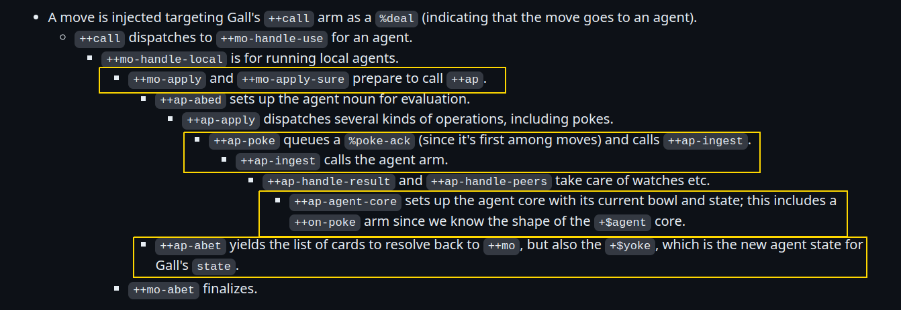

## On Agent Wrappers:

This mini-project is about how agent wrappers work. How they are built and structured, how they wrap around gall agents (and just what gall agents are, in terms of code-as-data and structures). I'll also make a simple agent wrapper and play around with it. While were at it, we might as well learn about versioned state for Gall Agents as well. 

###  Summary of Gall and Gall Apps:

Let's ignore the Arvo OS, right now, and fix our root to be Gall. The Gall Vane maintains all running agents and apps for a given ship, and acts as a bridge between the apps (via local/remote pokes, for example), passing messages to-and-fro.

- Conceptually, an agent is a state machine: A new state is a function of the previous state, and an input event.
- Practically, an agent is a *door with 10 arms*. With a `+$bowl` as a pinned sample, which all arms may access.
- All agent structures can be found at [sys/lull.hoon](https://github.com/urbit/urbit/blob/develop/pkg/arvo/sys/lull.hoon)
- Interaction is done with subscriptions, and pokes. This involves the *poke, watch and agent arms*.
- Every arm must produce a card (to send to another agent, or to the agent itself to perform more actions).
- Data being sent to other agents (via cards) must be searialized via *vases and cages*.
    - A vase is a pair that includes a type, and any piece of data that is an uptyped noun. We extract the type, and serialize the data and send it off. On the other end, we read the vase type head, and then cast our untyped data to recover the structure.
    - A cage is a pair of mark and vase. Rather than casting, this allows for more complex parsing of our vase.
- State: 
    - In sys/lull.hoon, our def is wrapped in a `^|` **iron contravariance** cast rune. This means we can substitute in any core that has samples and arm types that are supersets of our currently defined core. 
        - This also means our payload is write-only, 
        - and payload-tail is opaque to Gall.
        - When we rewrite our bowl, 


- We need a conceptual model of Gall. In the core school curriculum, Galls actual implementation is quite complicated (see picture below). 
    - Lets just assume that Gall is just a massive core with many nested arms, that Arvo can invoke when needed.
    - Inside Gall, is some kind of structure that maps agent names to agent cores
    - The agent cores themselves are just our standard 10 arm door, or one of our wrappers around a 10 armed door.

An actual execution pathway for poking an agent is below is seen below  (ca_gall):



**Notes:**
- `++mo`: Arvo Move Handler
- `++ap`: Agent Level Core
- *"To run an agent, we have to know the state of the agent, which includes its state and relevant bowl information"*
    - this is all stored in a `+$ yoke` structure

- *"A typical call from ++mo to ++ap will be predicated on ++ap setting up a Gall agent with its state and processing the incoming move through the appropriate arm."*
- **The Basic Process:**
    - So our `++ap` arm prepares the yoke, which stores bowl and relevent state information, and supplies it to our sitting agent core.
    - Once setup is done, the relevent agent arm (poke) is called with sample and bowl supplied, and then it runs. It ends with a potential state change, and a list of cards.
    - `++ap-abet` carries the list of cards back to `++mo`, and the modified agent state, which must be saved.
    - With a list of cards, the cycle can continue again until no cards are left.

### Simple Example: Understanding how default-agent works:

Going through line by line:

```hoon

::Import the skeleton core. Just crashes on everything - otherwise empty.
/+  skeleton
::  Wet gate defined with bartar. What's really going on?  
::  Bartar is a one armed core, so ?: is in our default $ arm slot.
::  We check the help arg, and in the false case, we define skeleton 
:: (which has a compiled core attached to the name).  
|*  [agent=* help=*]
    ::Likely, if a '&' flag is passed with () call, we give a message.
?:  ?=(%& help)
   :: ~| tracing printf with message below
  ~|  %default-agent-helpfully-crashing
  ::the skeleton core itself. Just a basic Agent Door, with no short forms.
  ::No imports, just use Gall Basic structures.
  skeleton
```

Next our modified door is present. Only arms of significance are included.

```hoon 
::Just another door with a bowl.
::Recall, when |% or another core building rune is encountered, we immediately take a snapshot of the subject.
::So this means the skeleton core is included in our payload of our door. 
::Once our core def ends, the hoon compiler looks  for a call right after the definition.
|_  =bowl:gall

::Notice the unit cell with the agent strucure from Gall. No "this"
++  on-init
  `agent

::No state defined, so envase sig.
++  on-save
  !>(~)

:: On poke is here - just crash out if we call, and print a barsig trace
++  on-poke
  |=  =cage
  ~|  "unexpected poke to {<dap.bowl>} with mark {<p.cage>}"
  !!
...
::End of Core.
--
```

Finally, how is default agent used in a standard agent? Like so:

```hoon
::Import the above def.
/+  default-agent
|%
:: Structure re-def as a shortform
+$  card  card:agent:gall
::End of core !!
--
^-  agent:gall
::Start of our agent door
|_  =bowl:gall
:: tistar names a list of deferred expressions (with no == term!)
:: Each time the name is mentioned, the D.E is substituted.
:: Each arm below can use our named D.E's, for shortforms.
+*  this  .
    def   ~(. (default-agent this %.n) bowl)

++  on-init
  ^-  (quip card _this)
  ::This is just the subject, and the subject is our agent core ::itself.
  `this
:: We defined def above, and use on-X:def to call default-agents
::arms. Each arm is just compiled, and the resultant hoon expressions
::(really, low level nock) are just run in place.
++  on-save   on-save:def
...
--
```

So after all that, here is what is going on: There are two basic mechanisms that allow all this to chain together. Really, they are just old lessons from HSL:

(1)  Core Definitions back-to-back: After `--` is encountered, the hoon compiler looks ahead to see if there are any other runes or cores to compile. A common confusion is that there are no more "rune" slots, so the code should not compile. **But it does.**  
- We know this to be **True** because in HSL we did countless `|%` examples, where the $ arm was called right after the `--`.

(2) When |% or any core rune is hit, the compiler grabs a snapshot of the subject, to compose into the payload tail of the core.
- This is **True**, it's in the notes for HSL.

**These two little facts are why it all chains together!**

Then Default Agent works as follows: 

1) Skeleton is imported. The compiled core is attached to the name skeleton.
2) In *default-agent*, we define a wet-core. Ignoring the help branch, the skeleton score is expanded. The compiler then looks beyond the end of the core, and compiles our door. So the payload tail of our default-agent includes skeleton and the subject.
3) In our agent, we import *default-agent*, which is a compiled core that is again bound to a name. We encounter a structure core `+$`. Once again, we look past the core and see another door. In the payload tail of this agent core, *default-agent, skeleton and the subject are stored*, as well as any *Deferred Expressions* that are referenced in the arms.

4) Finally, our compiled agent core is stored by Gall, bound to the agent name, and invoked and reupdated as the OS / other agents interact with it.

**So really, our default-agent wrapper is wrapped up inside the agents payload tail, not really "around" the core, structurally!**

### Breaking Down the +dbug package:

`+dbug` is a bit more complex, as it involves both a library and a generator. In dojo, we interact with the generator, which imports the library.

In our explanation, we will boil down the library to just the necessary pieces of code - we don't care about how specific slices of state and subscriptions are served to the user (this is a lot of the code of the library itself)


#### The Library:

```hoon

::No imports in sight.
:: Just one core, not one core composed after another.
|%
:: Inline poke structure
+$  poke
  $%  ... ==
:: In line about structure
+$  about ... ==
::Curiously, our entire gall agent is in an outer arm.
::Need to call (agent:dbug our-agent) to access.
++  agent
    :: An agent Gate
  |=  =agent:gall
  ^-  agent:gall
  ::Zapdot turns off stack trace for our entire door p
  !.
  ::The start of our agent door,
  |_  =bowl:gall
    ::  Tistar deferred expressions. this, the subject (the agent itself)
    ::  The second is the irregular SS of %~ . ag = agent:ourcore
    ::  which allows us to call (an-arm:ag) later on (?)
  +*  this  .
      ag    ~(. agent bowl)
    ++ on-poke
    |=  [=mark =vase]
    ^-  (quip card:agent:gall agent:gall)
    ::At the beginning, we check for the %dbug mark from the generator.
    ::If it is not, we call (on-poke: ag mark vase) which is the arm
    ::of our wrapped core!
    ?.  ?=(%dbug mark)
      =^  cards  agent  (on-poke:ag mark vase)
      [cards this]

 ++  on-peek
    |=  =path
    ^-  (unit (unit cage))
    ::We look for the generators %dbug mark again, and call
    :: the agents on-peek arm if it is not present.
    ?.  ?=([@ %dbug *] path)
      (on-peek:ag path)
    ?+  path  [~ ~]
      [%u %dbug ~]                 ``noun+!>(&)
      [%x %dbug %state ~]          ``noun+!>(on-save:ag)
      [%x %dbug %subscriptions ~]  ``noun+!>([wex sup]:bowl)
    ==


   ::Interestingly, other than poke and peek, every arm is defaulted.
    ::But not with default-agent. It uses the ag DE:
  ++  on-watch
    |=  =path
    ^-  (quip card:agent:gall agent:gall)
    =^  cards  agent  (on-watch:ag path)
    [cards this]

:: End of Core
--
```
So essentially, this library can be used by the generator itself, else it defalts to the underlying agent.


#### The Generator:

Code is a lot shorter. Lets examine it:

```hoon 
::  Import library
/+  *dbug

:: Say Generator, make a structure headtagged with %say
:-  %say
:: Gate call, sample is a struct. $: is the N-tuple builder
|=  $:  ::  environment
        *
        ::  inline arguments
        args=?(~ [what=?(%bowl %state) ~] [=poke ~])
        ::  named arguments
        ~
    ==
:: $ arm starts here. Return a head tagged cell with one of three exprs expressions.
:: return a cell tagged with %dbug, and one of the following
:-  %dbug
?-  args
  :: No Args
  ~          [%state '']
  :: More specific subset, the bowl or state.
  [@ ~]      ?-(what.args %bowl [%bowl ~], %state [%state ''])
  :: Poke args?
  [[@ *] ~]  poke.args
==
```

But how does the %dbug mark and associated output cells get to the library for parsing? All generators have a return cask, so somehow this is passed there.

Casks are only used to send data over the network, not locally. So here it is being sent from a generator to our agent library (somehow?)

#### Sample Agent Usage:

Finally, lets examine how +dbug is used for the common %echo app that is found in ASL:

```
:: Structure file imported
/-  *echo
::Default and dbug imported, so both are already compiled
/+  default-agent, dbug
::Start our first core
:: Contains state, some other shorthands
|%
+$  versioned-state
  $%  state-0
  ==
+$  state-0
  $:  [%0 values=(list @)]
  ==
+$  card  card:agent:gall
::End of core
--
::Compiler looks beyond the --, sees a gate call.
::Pass agent:dbug arm our gall agent core below.
:: =| expands to =+  *p  q, so we pin an empty state to the subject.
%-  agent:dbug
=|  state-0
::Define a deferred exppression, compose with our door itself.
=*  state  -

::lets you reference the whole state while also being able to reference its :: individual elements like foo and bar, without having to do foo.state
^-  agent:gall
|_  =bowl:gall
::Deferred expressions inside our core only.
+*  this     .
    ::allows us to reference default gate.
    ::for example, we can write on-init:default to plug a default arm
    default  ~(. (default-agent this %|) bowl)


...
::Using our internal core default expressions.
++  on-arvo   on-arvo:default
++  on-leave  on-leave:default


```


## Practical Exercise: 


### References:

[ca_gall]: https://github.com/hoon-school/core-academy-2023/blob/master/ca11.md
